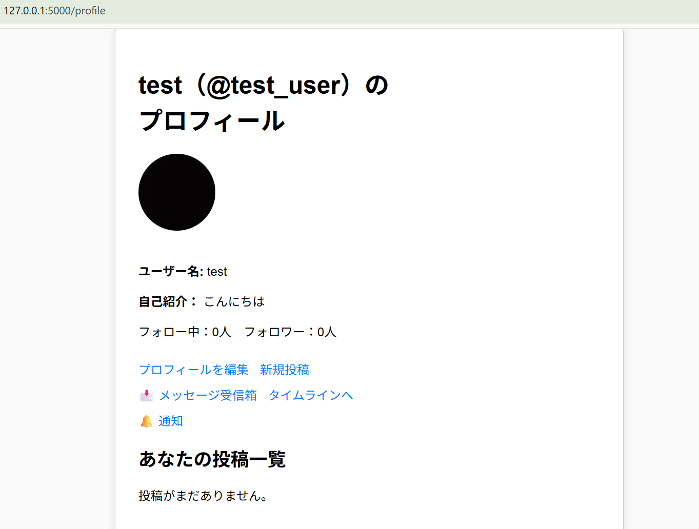
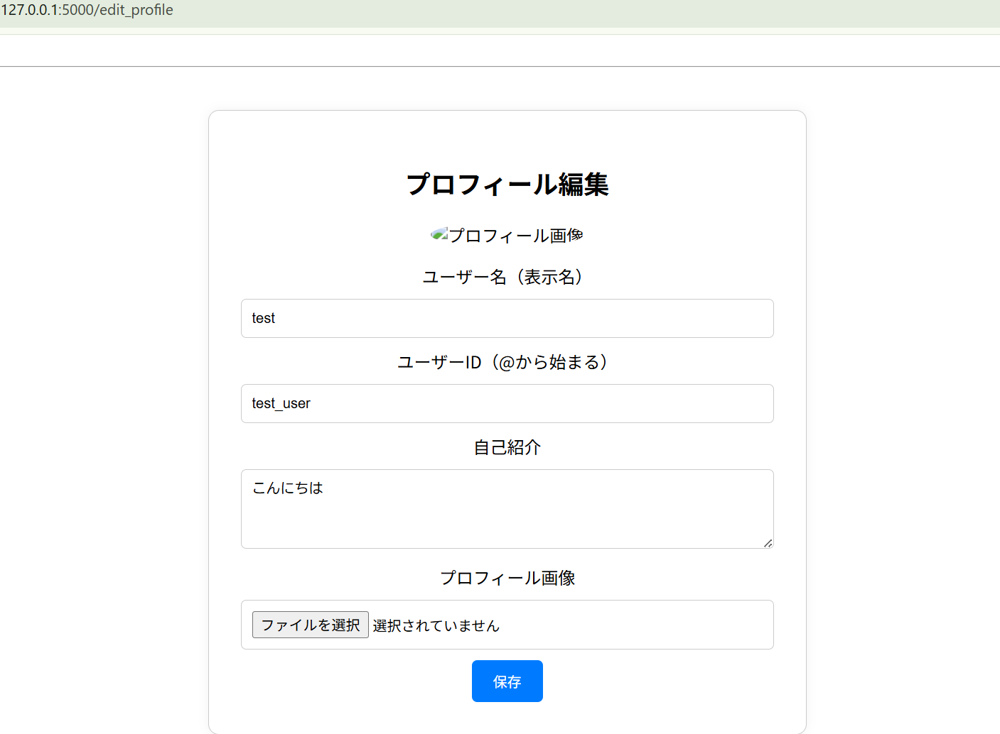
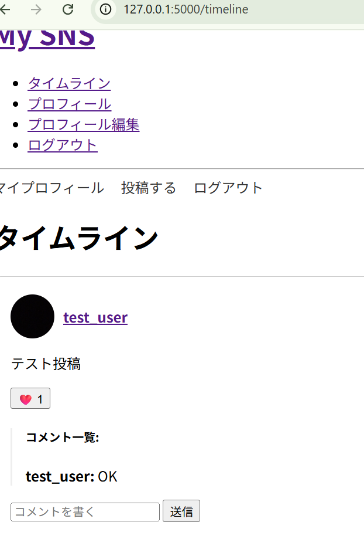

# MySNS: 高機能なSNSアプリケーション

[](https://www.python.org)  
[](https://flask.palletsprojects.com/)  
[](https://www.sqlite.org/index.html)  
[](https://developer.mozilla.org/ja/docs/Web/Guide/HTML/HTML5)  
[](https://developer.mozilla.org/ja/docs/Web/CSS)  
[](https://developer.mozilla.org/ja/docs/Web/JavaScript)

FlaskとSQLiteを使って構築した、多機能かつスケーラブルなSNSアプリケーションです。  
認証・画像投稿・DM・通知・ハッシュタグ機能など、実際のサービスを意識した構成で、Python・Web開発の学習成果を形にしました。

---

## ✨ 主な機能

### 1. アカウント管理
- **ユーザー登録 / ログイン / ログアウト**
- **メールによる本人確認（登録時）**
- **パスワードリセット機能（メール連携）**
- **プロフィール編集（表示名・自己紹介・画像）**

  


---

### 2. 投稿・インタラクション
- **投稿機能（テキスト＋画像）**
- **非同期「いいね」・フォロー（Fetch API使用）**
- **コメント機能**



---

### 3. ユーザー間コミュニケーション
- **ダイレクトメッセージ（DM）：1対1のプライベートチャット**
- **リアルタイム通知（フォロー・いいね・コメント）**
- **ハッシュタグ機能：#タグ自動リンク＋タグ一覧表示**

---

## 🛠 使用技術

- **Python 3.x**：主要ロジック
- **Flask**：軽量なWebフレームワーク
- **SQLite3 + FTS5**：全文検索付きローカルDB
- **HTML / CSS / JavaScript**：UI/UX構築
- **Jinja2**：テンプレートエンジン
- **Bootstrap 5**：フロントエンドデザイン
- **Fetch API**：非同期通信


---

## 🚀 セットアップ手順

1.**リポジトリをクローン**
```bash
git clone https://github.com/your-username/my-sns-project.git
cd my-sns-project

2. **仮想環境の作成**
```bash
python -m venv venv
source venv/bin/activate  # Windowsなら .\venv\Scripts\activate

3. **依存ライブラリのインストール**
```bash
pip install -e .

4. **.envの作成**
```bash
SECRET_KEY='your-generated-secret-key'
MAIL_SERVER='smtp.gmail.com'
MAIL_PORT=587
MAIL_USE_TLS=True
MAIL_USERNAME='your-email@gmail.com'
MAIL_PASSWORD='your-app-password'

5. **データベースの初期化**
```bash
flask --app src/my_sns_app init-db

6. **アプリケーション起動**
```bash
flask --app src/my_sns_app run


7. **ブラウザでアクセス**
```bash
http://localhost:5000/


💡 今後の展望 / 改善予定
フォローベースのタイムライン表示

CSRF対策の強化（Flask-WTF）

SQLAlchemyによるORM化

pytestによる自動テストの追加

Gunicorn / Dockerでの本番環境構築
